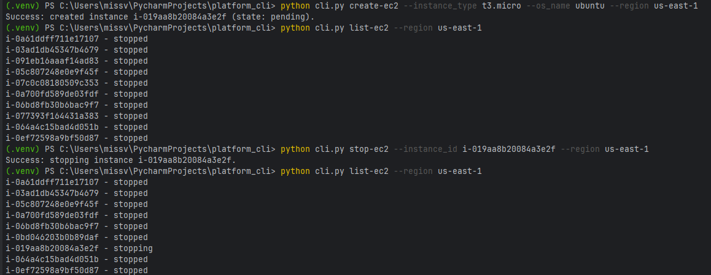
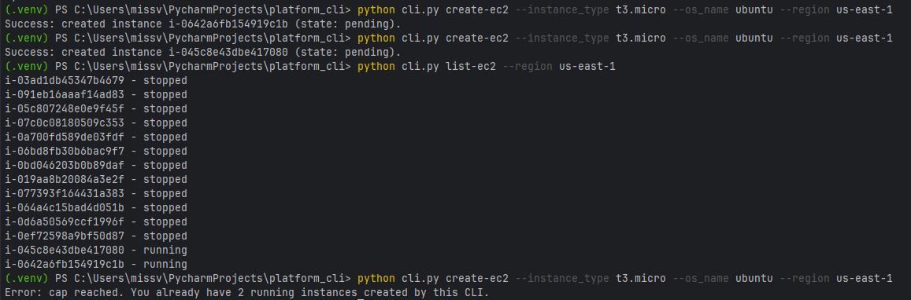
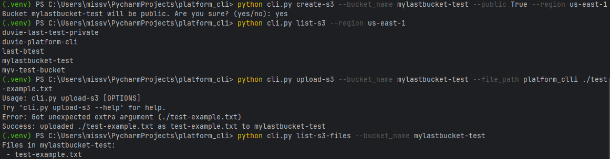
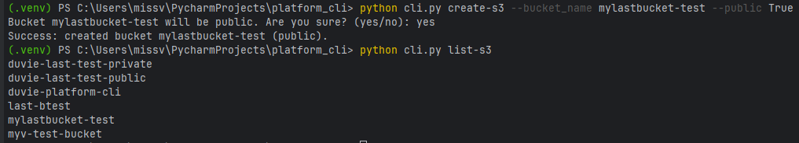
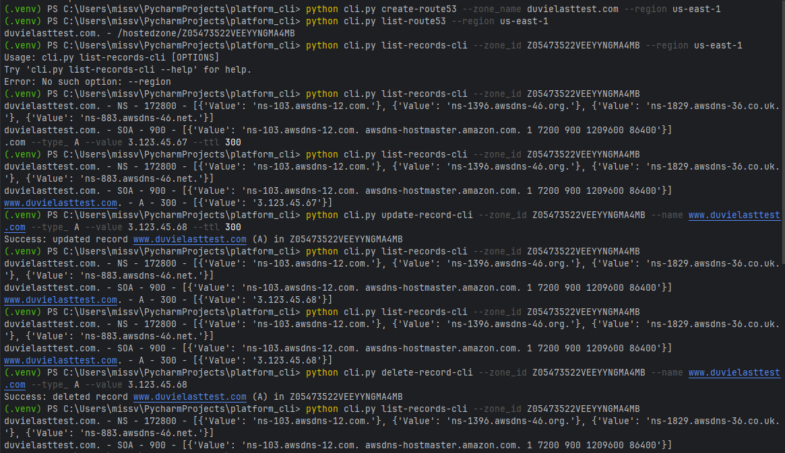

# Platform CLI - Self Service AWS Management

Hi there! 👋  

This CLI tool lets you safely create, manage, and automate AWS resources for development projects. It’s built to help developers and junior DevOps engineers provision EC2 instances, S3 buckets, and Route53 zones while enforcing safe standards.  

All resources created by this CLI are tagged consistently with:

- `CreatedBy=platform-cli`
- `Owner=duvie`
- `Project=platform-cli`
- `Environment=dev`

---

## Features

### 1. EC2 Instances
- **Create**: Only `t3.micro` or `t2.small`. Latest Ubuntu or Amazon Linux AMIs. Max 2 running instances at a time.
- **Manage**: Start or stop only CLI-created instances (validated by tags).
- **List**: Shows only instances created via the CLI.

### 2. S3 Buckets
- **Create**: Choose public or private. Public buckets ask for confirmation (`yes/no`) before creation.
- **Upload files**: Only to CLI-created buckets.
- **List**: Shows only CLI-created buckets.

### 3. Route53
- **Create zones**: Add new DNS zones.
- **Manage records**: Create, update, or delete records only for CLI-created zones.
- **List**: Shows only CLI-created zones and records.

---

## How This CLI Works

- You tell the CLI **what resource** you want to manage (EC2, S3, or Route53) and **what action** you want to take (create, start, stop, update, delete, or list).  
- The CLI gives you **clear feedback** so you’ll always know if your request succeeded and what the current status of the resource is.  
- All resources are **securely managed**: no secrets are stored in the code, and it uses AWS roles/profiles to access your account safely.  
- Every resource you create is **consistently tagged** so it’s easy to see what the CLI manages.  
- Need help? Use `python cli.py --help
` to see available commands and parameters. The CLI explains itself in plain language.
For example: `python cli.py create-ec2 --help`

---

## Prerequisites
### Before running the CLI, make sure you have:
1. **Python & Virtual Environment**
   - Python version used: 3.13
   - IDE used: PyCharm (optional, any code editor works)


2. **AWS Credentials**
Configure AWS CLI credentials by running:
   ```bash
   aws configure
You will be prompted for:
- AWS Access Key ID
- AWS Secret Access Key
- Default region name (e.g., us-east-1)
- Default output format (e.g., json)

If you don’t have access keys yet:
- Log in to your AWS Management Console.
- Go to My Security Credentials (click on your account name → Security Credentials).
- Under Access keys, click Create access key.
- Copy the Access Key ID and Secret Access Key and keep them safe.
- Then run `aws configure` to set them up locally.
Note: Keep your secret key private and never share it in your code or repository.

### Python Modules Used
This CLI uses the following modules (already in `requirements.txt`):
- `boto3` – for AWS services (EC2, S3, Route53)
[Learn more about boto3](https://boto3.amazonaws.com/v1/documentation/api/latest/index.html)
- `click` – to handle the CLI commands [Learn more about Click](https://click.palletsprojects.com/)
- `botocore` – for AWS API error handling [Learn more about Botocore](https://botocore.amazonaws.com/)
# Getting Started
1. Clone the repo and create a virtual environment:
```bash
git clone <your-repo-url>
cd platform_cli
python -m venv .venv
```
2. Activate your virtual environment:
```bash
# Windows
.venv\Scripts\activate

# macOS/Linux
source .venv/bin/activate
```
3 .Install dependencies 
```bash
pip install -r requirements.txt
```
## CLI Usage

Type the following:
```bash
python cli.py --help 
```
To see all commands. 
- Tip: Replace placeholders like <id> or <zone-id> with actual AWS values from your account.

Commands follow this structure: resource-action, for example:
## EC2
```bash
python cli.py create-ec2 --instance_type t3.micro --os_name ubuntu --region us-east-1
python cli.py list-ec2 --region us-east-1
python cli.py start-ec2 --instance_id <id> --region us-east-1
python cli.py stop-ec2 --instance_id <id> --region us-east-1
```
### My Output screenshots for EC2:

Here it shows you can only run 2 instances:

---
## S3 
```bash
python cli.py create-s3 --bucket_name mybucket --public True --region us-east-1
python cli.py list-s3 --region us-east-1
python cli.py upload-s3 --bucket_name mybucket --file_path ./file.txt
python cli.py list-s3-files --bucket_name mybucket
```
### My Output screenshots for S3:
Shows that when creating a public bucket, the cli will ask for confirmation:

This has no region specified but still works:


---
## Route53
```bash
python cli.py create-route53 --zone_name example.com
python cli.py list-route53
python cli.py list-records-cli --zone_id <zone-id>
python cli.py create-record-cli --zone_id <zone-id> --name www.example.com --type_ A --value 1.2.3.4 --ttl 300
python cli.py update-record-cli --zone_id <zone-id> --name www.example.com --type_ A --value 1.2.3.5 --ttl 300
python cli.py delete-record-cli --zone_id <zone-id> --name www.example.com --type_ A --value 1.2.3.5
```
### My Output screenshots for Route53:


---
## Thank You for Using Platform CLI

Created by **Duvie**, 2025  


